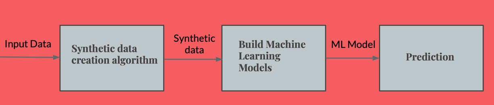

#### **Problem Definition:**
The probability of human error exists even under highly trained professionals.
Use of data analytics tools applied to the available data can help health care providers identify the early signs of Heart Ailments.

Hence we provide a way in the project which could help the modelling and prediction of Medical data a
little better.

#### Approach:

#### _Dataset_

The dataset used is the Cleveland Heart Disease Dataset from UCI Repository.
● It contains 303 data instances, each of which is a patient record.
● There are 14 attributes for both male and female patients with readings like blood pressure, cholesterol level, blood sugar level, maximum heart rate, number of major vessels, etc.

#### Algorithms Executed
* k-Nearest Neighbours
* Support Vector Machines
* Logistic Regression
* Quadratic Discriminant Analysis
* Decision Tree

